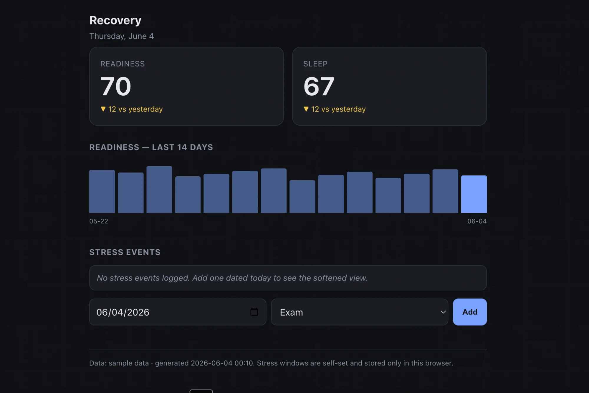
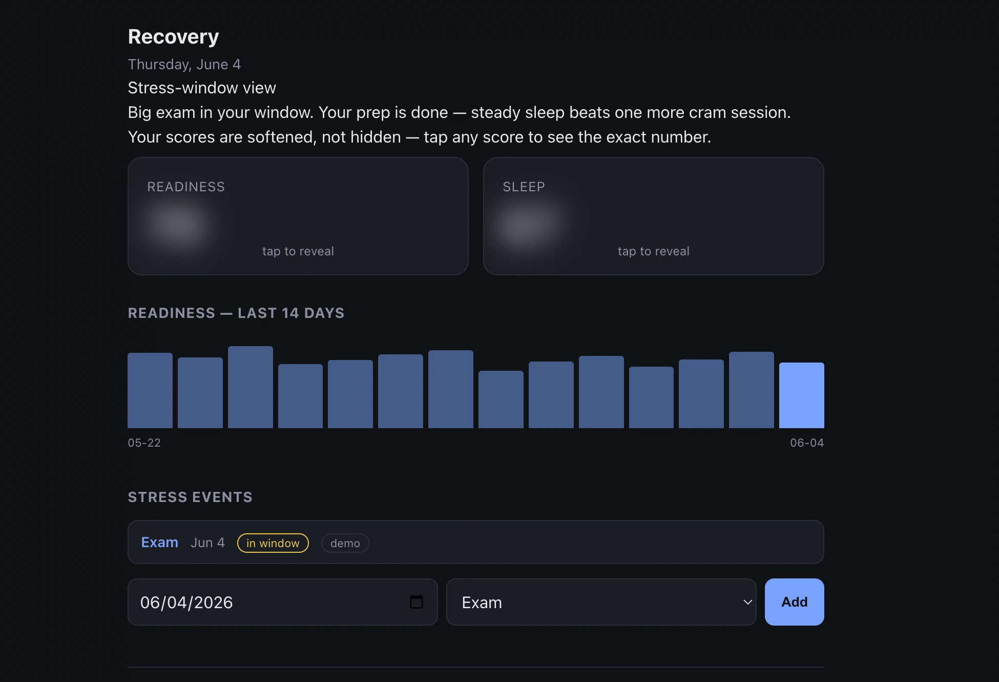

# Stress-aware recovery dashboard

A personal Oura dashboard that softens how Readiness and Sleep are presented during a
self-set "stress window" around a high-stakes event (an exam, a presentation). Instead
of leading with a raw recovery number on an already-stressful morning, it leads with a
supportive, actionable reframe and blurs the score behind a tap-to-reveal — the number
is always one tap away.

The problem it addresses is **orthosomnia**: seeing a low recovery score the morning of
something stressful adds anxiety at the moment you can least use it, and the number
rarely changes what you can do in the next two hours.

## What it looks like

| Normal day | Inside a stress window |
|---|---|
|  |  |

On a normal day you see the raw scores, the day-over-day change, and the 14-day trend.
Inside a self-set stress window the dashboard leads with an actionable reframe and blurs
the scores behind a tap-to-reveal — the exact number is always one tap away, and a
signpost always says the score is softened, not hidden.

## Design rules (these are the point)

The softening is built to support a healthy relationship with your data, never to
deceive:

- **Opt-in and self-set.** Nothing is softened unless *you* log a stress event. The
  windows are yours.
- **Softened, not hidden.** Tap any score to see the exact number. Always signposted.
- **Uniform across score bands.** Every score blurs in a stress window, not just low
  ones — otherwise the presence of softening would itself leak that the score is bad.
- **Reframe keys off event type, never the hidden score.** Same anti-leak principle.

## How it works

```
build.py  ──►  reads Oura data (if OURA_TOKEN) or sample_data.json
          ──►  inlines it into template.html
          ──►  writes a self-contained index.html

index.html (in browser):
   today within [event - 2 days, event + 1 day] ?
     yes → softened view (reframe + blurred, tap-to-reveal scores)
     no  → normal scores + 14-day trend
```

Stress events live in the browser's `localStorage` (per-device), added via the in-page
form. The stress-window math runs client-side against today's date, so the view is
correct whenever you open the file.

## Run it

```bash
# Sample data (always works, no setup):
python build.py
open index.html

# Real Oura data:
cp .env.example .env          # then paste your token into .env
python build.py               # pulls last 14 days, falls back to sample on any error
open index.html
```

Get a personal access token at https://cloud.ouraring.com/personal-access-tokens .
No third-party packages required (standard library only).

## Demo

Open `index.html`, add a stress event dated **today**, and the dashboard shifts into the
softened view. Tap a score to reveal the exact number.

## Files

| File | Purpose |
|------|---------|
| `build.py` | Fetch (or sample) → inline data → `index.html` |
| `template.html` | Dashboard markup, styles, and logic (data injected at build) |
| `index.html` | Generated, self-contained output (committed for clone-and-open) |
| `sample_data.json` | 14 days of fallback data so the demo always renders |
| `data.json` | Your real fetched data (gitignored) |
