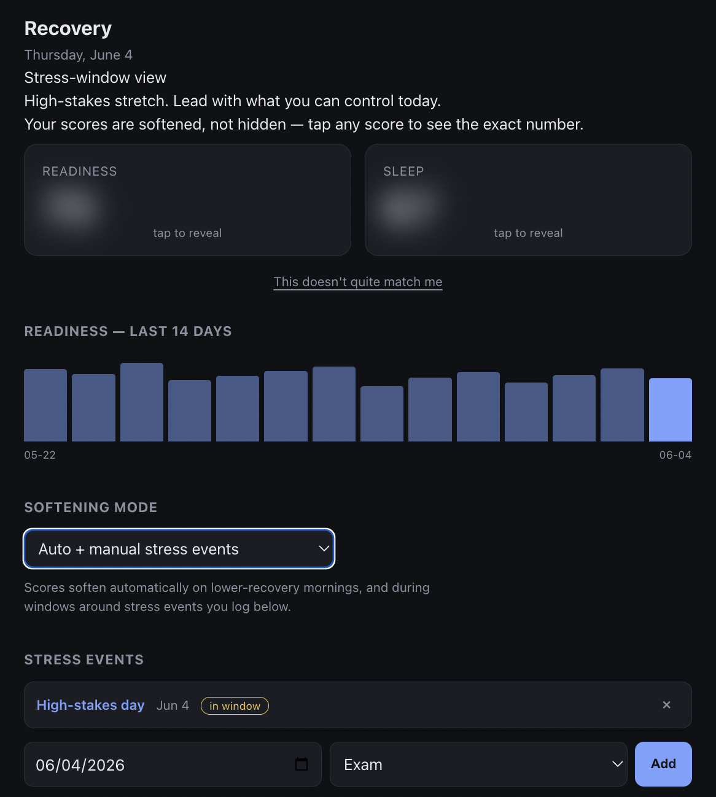
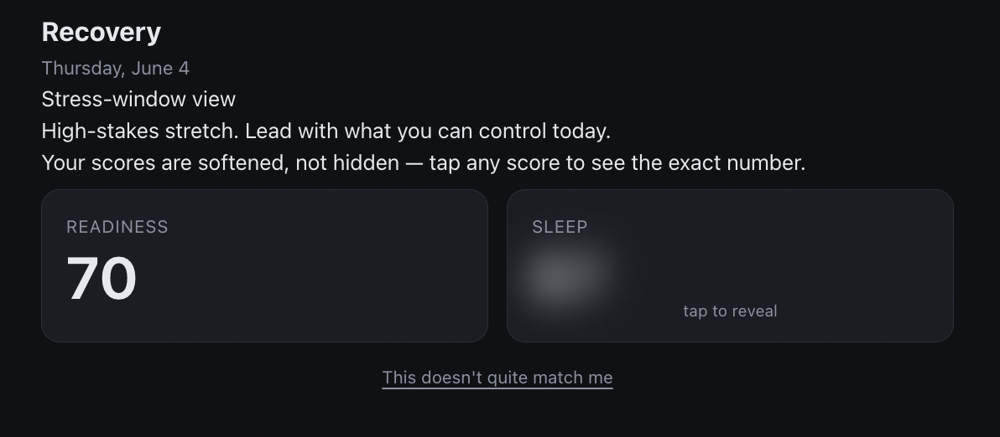
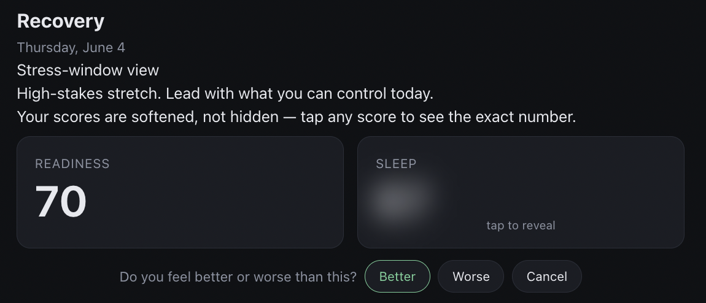
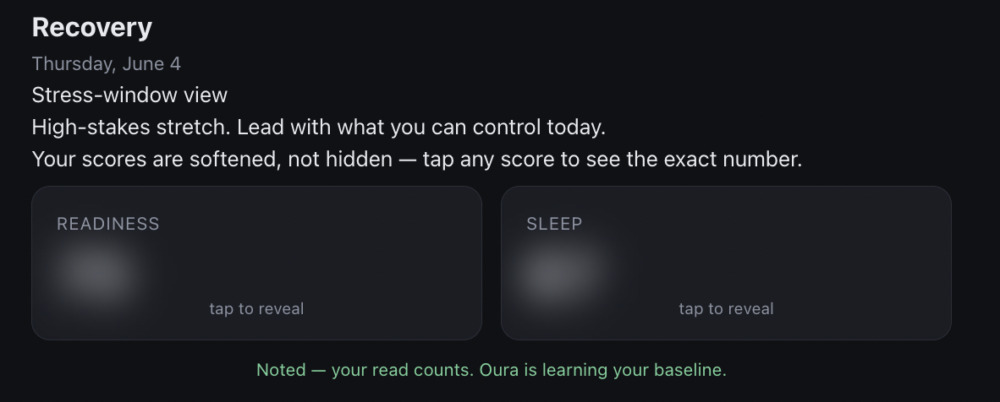
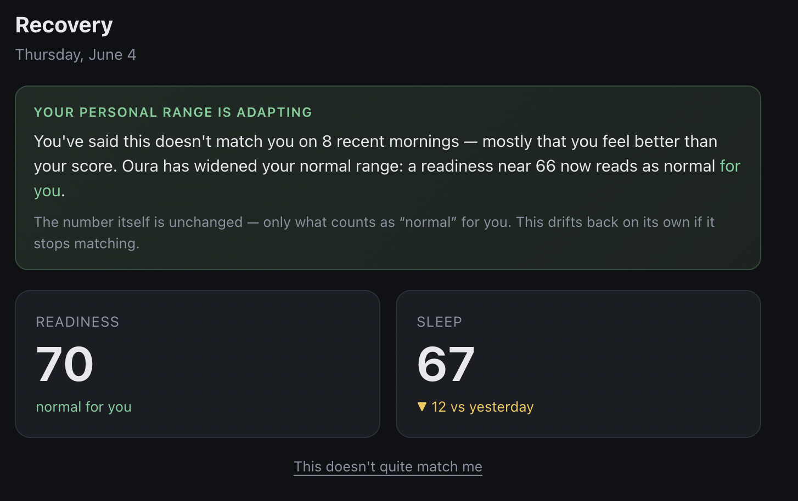

# Stress-aware recovery dashboard

**Live demo** ([no install](https://ellabellae.github.io/ourademo/)):
[**calibrated "normal for you"**](https://ellabellae.github.io/ourademo/?seed) ·
[stress-window view](https://ellabellae.github.io/ourademo/?demo) ·
[auto-softened morning](https://ellabellae.github.io/ourademo/)

A personal Oura dashboard that softens how Readiness and Sleep are presented on the
mornings a raw recovery number is most likely to do harm. Instead of leading with the
score, it leads with a supportive, actionable reframe and blurs the number behind a
tap-to-reveal — the exact value is always one tap away.

It softens in two ways, and you choose which:

- **Automatically**, on lower-recovery mornings (detected from your own recent baseline) —
  so it reaches you even on the days you'd never think to flag.
- **Manually**, inside a self-set "stress window" around a high-stakes event you log
  (an exam, a presentation).

And when your scores *keep* not matching how you feel, it adapts to your personal baseline
instead of asking you to trust a number that doesn't fit — so you stay with your data rather
than walking away from it.

The problem it addresses is **orthosomnia**: seeing a low recovery score the morning of
something stressful adds anxiety at the moment you can least use it, and the number
rarely changes what you can do in the next two hours.

The everyday version is just as corrosive. In a USA TODAY piece on wearables and longevity
([June 4, 2026](https://www.usatoday.com/story/life/health-wellness/2026/06/04/wearable-devices-health-longevity/89877299007/)),
one person describes waking up feeling genuinely good, checking her Oura score, finding it
didn't match how she felt — and ending up feeling *worse* than before she looked. The
number didn't just inform her morning; it overrode her own accurate read of her body. That
mismatch — a good feeling, contradicted by the data — is exactly what auto-detection is
built to catch. *(Story paraphrased from the USA TODAY article linked above.)*

## What it looks like

| Normal day | Inside a stress window |
|---|---|
|  |  |

On a normal day you see the raw scores, the day-over-day change, and the 14-day trend.
When softening is active — automatically on a lower-recovery morning, or inside a self-set
stress window — the dashboard leads with an actionable reframe and blurs the scores behind
a tap-to-reveal. The exact number is always one tap away, and a signpost always says the
score is softened, not hidden.

## Softening modes

You pick how softening is triggered (the choice is stored per-device and defaults to
**Auto + manual**):

| Mode | What softens |
|------|--------------|
| **Auto + manual** (default) | Lower-recovery mornings *and* windows around stress events you log |
| **Auto only** | Lower-recovery mornings — no logging needed |
| **Manual only** | Only inside windows around stress events you log |
| **Off** | Never; always shows raw scores |

**Why default-on.** Opt-in softening reaches only the people self-aware enough to turn it
on — rarely the person spiralling over a number at 6am. Defaulting to auto means the
feature reaches the mornings you'd never think to flag. It is always signposted and one tap
from the real number, and you can switch to Manual or Off at any time.

**Auto-detection** softens when today's Readiness is at or below an absolute floor, or
meaningfully below your recent baseline. One honest caveat about the anti-leak rules below:
a manual stress window keys off the *event*, never the score, so it leaks nothing about how
you did. Auto-detection, by definition, correlates with a lower day — that is the contract
you opt into. Both scores still blur uniformly, so it never reveals *which* metric is low,
only that today reads a little lighter.

## When the number doesn't match you

Hiding a number on a hard morning treats the symptom. The deeper problem in the article is
a number that *overrides* an accurate, good feeling — and the response is to quit the ring
entirely, losing HRV and sleep along with it. So the dashboard lets your own read count, and
adapts to it.

Under each morning's scores is a quiet link: **"This doesn't quite match me."** Tap it and
it asks one thing — **do you feel better or worse than this?** — and logs your answer
against today's score. Nothing to recall cold: the score is right there to react to.

| 1 · the quiet link | 2 · better or worse? | 3 · logged, no debate |
|---|---|---|
|  |  |  |

Consistent, same-direction divergence then **widens your personal normal range**:

- **Trigger:** 5 consecutive days, *or* 10 days in a rolling month, that mostly point the
  same way (≥80%). Mixed signals mean a variable week, not a wrong baseline — so nothing
  moves.
- **What adapts:** your *personal normal range*, not the displayed score. If you keep feeling
  better than your lows, a readiness that used to flag now reads as "normal for you" and
  auto-softening eases off. The measured number stays exactly what it was.
- **Bounded and reversible:** the shift is gradual and capped, and it drifts back on its own
  as old logs age out — one rough month can't permanently distort your scores.
- **The "worse" side gets care, not just a smaller number:** consistently feeling worse than
  a decent score can be a real signal (overtraining, illness, low mood), so that path also
  nudges you to add a note or reach out — it isn't only a numeric tweak.

After enough consistent reads, the dashboard shows the adaptation directly — the measured
score is unchanged, but it now reads as *normal for you* (this is the `?seed` view):



This is the retention move: the ring earns trust by adapting to *you*, so you stay in a
truthful relationship with the data instead of abandoning it.

> **Demo caveat.** This client-side demo learns from the disagreement alone. The honest
> production version would also check what *actually happened next* (did the "I feel better"
> mornings turn out fine, or end in a crash?) before moving a baseline — that's what
> separates learning your true baseline from learning to flatter you.

## Design rules (these are the point)

The softening is built to support a healthy relationship with your data, never to
deceive:

- **You choose the trigger.** Softening is off, manual, auto, or both — your call, stored
  on your device. Auto defaults on so it reaches the mornings you'd never flag; nothing is
  irreversible and Off is always one click away.
- **Softened, not hidden.** Tap any score to see the exact number. Always signposted.
- **Uniform across score bands.** Every score blurs together, not just low ones — so the
  blur never reveals *which* metric is down.
- **Reframe keys off the trigger, never the hidden score.** In a manual window it speaks to
  the event; on an auto-softened morning it speaks to recovery being lower and puts how you
  *feel* ahead of the number. Neither one reads the blurred value.
- **Your read is data, not a complaint.** When the score doesn't match you, you log it as
  your own signal — and only *consistent, same-direction* divergence adapts your personal
  normal range. The measured number is never rewritten.

## How it works

```
build.py  ──►  reads Oura data (if OURA_TOKEN) or sample_data.json
          ──►  inlines it into template.html
          ──►  writes a self-contained index.html

index.html (in browser), per your chosen mode:
   auto:   today's Readiness ≤ floor, or ≤ baseline − 5   → softened
   manual: today within [event − 2 days, event + 1 day]   → softened
   else                                                   → raw scores + 14-day trend
   (softened = reframe + blurred, tap-to-reveal scores)

   "this doesn't match me" logs (better/worse) →
     5 consecutive, or 10/month, ≥80% one way      → widen personal range
     (shifts the floor/baseline, capped & decaying — never the score itself)
```

Stress events, your mode choice, and your "this doesn't match me" logs live in the browser's
`localStorage` (per-device). The window math, auto-detection, and baseline calibration all
run client-side against your data, so the view is correct whenever you open the file.

## Run it

```bash
# Sample data (always works, no setup):
python build.py
open index.html

# Real Oura data:
cp .env.example .env          # then paste your token into .env
python build.py               # pulls last 14 days, falls back to sample on any error
open index.html
```

Get a personal access token at https://cloud.ouraring.com/personal-access-tokens .
No third-party packages required (standard library only).

## Demo

Open `index.html`. With the sample data, today's Readiness (70) is a lower-recovery
morning, so in the default **Auto + manual** mode the dashboard opens already softened.
Switch the mode to **Off** to see the raw scores, add a stress event dated **today** to see
the manual stress-window reframe, and tap any score to reveal the exact number.

Under the scores, tap **"This doesn't quite match me" → Better** to log your read. Do that
on several days running (or ~10 in a month) and the dashboard widens your personal normal
range: a banner appears and the lower morning stops being softened, because it's now normal
*for you*.

Three one-click views (nothing is persisted by the `?` links):

- `index.html` — auto-softened lower-recovery morning (sample default)
- `index.html?demo` — manual stress-window reframe
- `index.html?seed` — the **calibrated** "normal for you" state, after a week of "feels
  better" logs (so the personal-range adaptation is visible without waiting days)

## Files

| File | Purpose |
|------|---------|
| `build.py` | Fetch (or sample) → inline data → `index.html` |
| `template.html` | Dashboard markup, styles, and logic (data injected at build) |
| `index.html` | Generated, self-contained output (committed for clone-and-open) |
| `sample_data.json` | 14 days of fallback data so the demo always renders |
| `data.json` | Your real fetched data (gitignored) |
